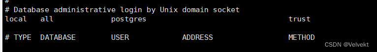
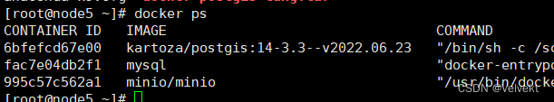
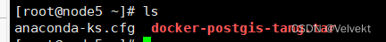
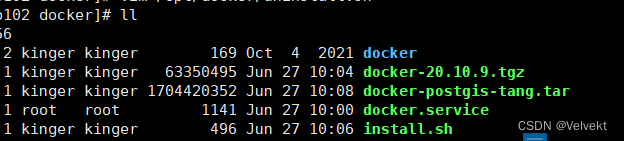

# docker安装PostgreSQL+PostGIS+制作镜像

参考[在Docker中部署PostgreSQL+PostGIS_若海软件科技的博客-CSDN博客_docker ](https://blog.csdn.net/eqmaster/article/details/108638088)

postgis

```
#拉取镜像，这个包包含了postsql和postgis
 docker pull kartoza/postgis:14-3.3--v2022.06.23
#运行容器
docker run --name postgrest_one -p 5432:5432 -e POSTGRES_MULTIPLE_EXTENSIONS=postgis -d -t kartoza/postgis:14-3.3--v2022.06.23
#进入容器
docker exec -it postgrest_one bash
#容器内安装一个编辑器，例如nano
apt-get update && apt-get install nano
cd /etc/postgresql/14/main/
#在文件pg_hba.conf中，需要对“数据库管理登录通过Unix域套接字（应该在第85行）下的设置从peer更改为trust，然后重新启动Docker容器。
```



```
#重启容器
docker restart postgrest_one
#进入容器
docker exec -it postgrest_one psql -U postgres
#更改密码
ALTER USER postgres WITH PASSWORD '123456';
#开启postgis扩展
postgres=# CREATE EXTENSION postgis;
postgres=# \q
```

## 开始制作镜像 ##

[Docker如何制作自己的镜像，你了解吗？ - 知乎](https://zhuanlan.zhihu.com/p/512313334)



```
#制作镜像
docker commit 6bfefcd67e00 postgis:one
#导出镜像
docker save -o docker-postgis-one.tar postgis:one
```



## 离线安装docker ##

[Docker使用(六) — Docker离线安装部署_一恍过去的博客-CSDN博客_docker 离线安装 ](https://blog.csdn.net/zhuocailing3390/article/details/121797180)



```
#导入镜像
docker load -i docker-postgis-one.tar 
```

```
#启动容器
docker run --name postgrest_one -p 5432:5432 -e POSTGRES_MULTIPLE_EXTENSIONS=postgis -e POSTGRES_PASSWORD=123456 -d -t 7a04d76eace1
```

文章知识点与官方知识档案匹配，可进一步学习相关知识

————————————————

版权声明：本文为CSDN博主「Velvekt」的原创文章，遵循CC 4.0 BY-SA版权协议，转载请附上原文出处链接及本声明。

原文链接：https://blog.csdn.net/qq_40736292/article/details/125491081
